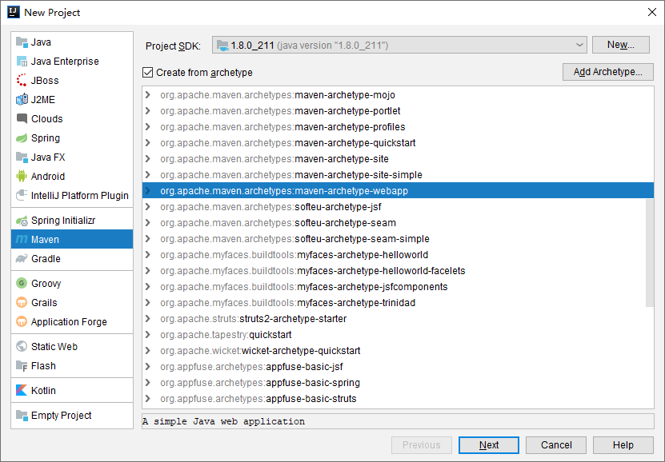
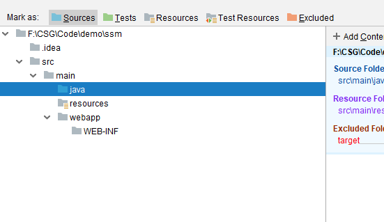
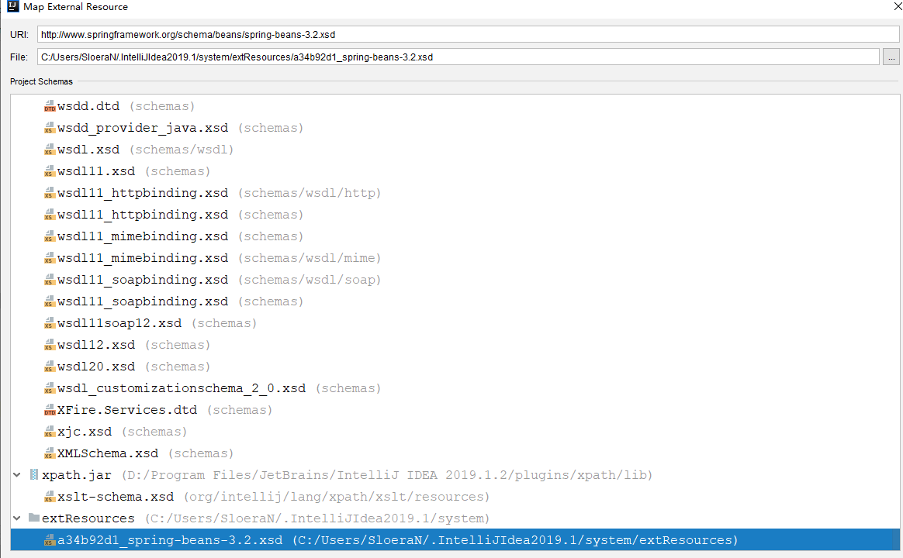

## maven工程创建步骤

1. 新建maven工程，选择`Create from archetype>maven-archetype-webapp`。依次选择maven版本（不选择最高）。

   

2. 设置`Project Structure`

   新增`java/resources`文件，标记为源及资源

   

3. 新建`spring-context.xml`文件，配置freekarker

   引入dtd。

   

   

4. 